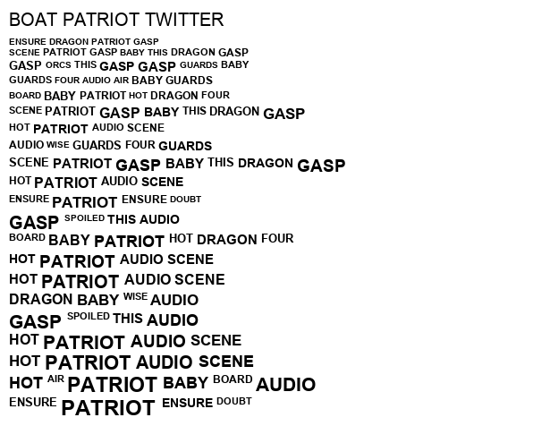

# IBM Poem Writer

## Explanation

[IBM Poems](https://elmcip.net/creative-work/ibm-poem) are a type of algorithmic poetry that lends itself to being automated with something like python. This was written for fun and likely has some inefficiencies, but hey, it works!

---

## How to use this

Clone this repository and run the main.py file. You will be prompted to enter one word for each letter of the dictionary. The word does not have to start with -- or even include -- the letter that you are on (any word can be used for any letter, no restrictions). 

Once you've entered 26 words, you will be prompted to enter a 3 letter 'seed' to generate your IBM Poem. It can be a word or acronym, or it could be totally random. Once you've done this, your poem will be generated and printed to the console. 

In addition to this, an image will be generated for you. This is because a true IBM Poem has words that increase in font size after each usage. Therefore, the image that you recieve is your final IBM Poem. 

Congratulations, you're now a Cyber-Shakespeare!

---

## Example Image

---

### Credit

Credit is due to Dr. Chris Funkhouser, professor of Digital Poetry at the New Jersey Institute of Technology. Dr. Funkhouser introduced me to the world of Digital Poetry, and IBM Poems. 

